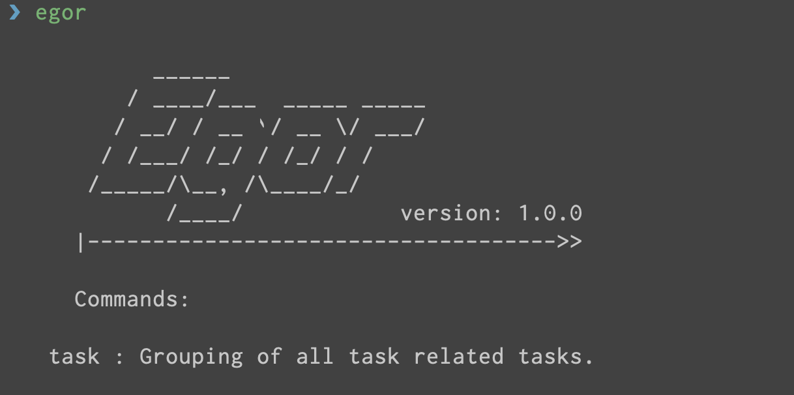
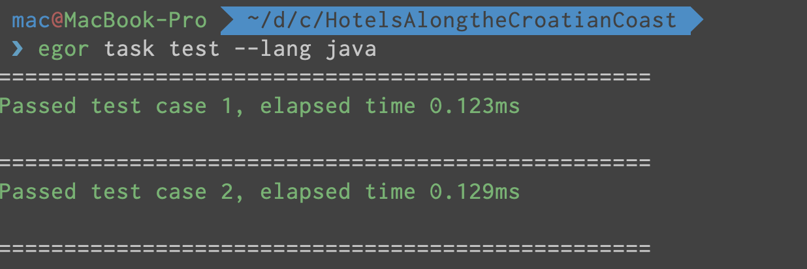

# Egor

[](https://travis-ci.com/chermehdi/egor)

## Description

- as most Competitive programmers don't have the luxuary of using IDE's such as intellij to benifit from the
  `CHelper` tool (maybe because they don't like the added overhead of IDE's or the prefere eclipse or, as most of the people i know, they use `C++`, parsing tasks can become tedious, and here where **egor** can help, by providing a simple 
  cli for parsing and running your tasks.


## Usage

- Just install egor by doing `pip install egor`
- You should also install *(if you don't already have it)* [Competitive companion](https://github.com/jmerle/competitive-companion)
- And voila, you can start using it as any other command line app, just type egor to see the help, and there is help for
every subcommand provided by `egor`


- Open a codeforces or a spoj problem, run `egor task parse` and press the plus button of `Competitive companion`, a new directory with 
the name of task will be generated, with the `input` and `output` files, and a sample `source` file.
- When you write the solution for your problem you  can type `egor task test` to test your solution against the provided sample `input`.

- You can run `egor task copy` to copy the source code of your solution to the clipboard
- The location of the configuration file to configure some default values is `${home_dir}/.egor/configuration` and it's in the `reStructuredText` format,This is sample fo a configuration file:
```
    [egor]
    egor_port = 6174
    egor_default_lang=cpp
    
    [core]
    first_run = yes
```
- in doubt you can always run `egor task -h` to see the help of commands.

## Developer guide

- You should have pip installed
- Clone the current repository, and run `pip install -e .` to have 
a version of 'egor' installed in your machine so you can test it
- Unit testing is important, any added feature should be associated with a unit/integration test
- At least one reviewer should see your code before merging to master.

## Contribution
- You can contribute to the project by raising issues, writing tests, suggesting features, and making pull requests.